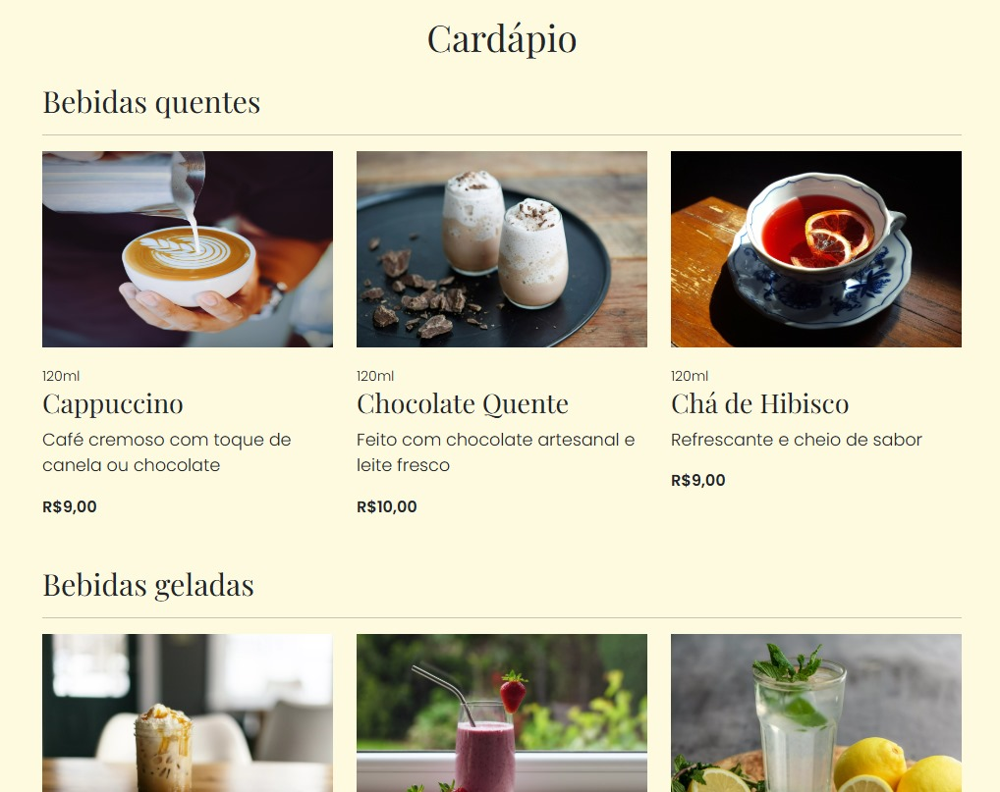

  <h1>O site é um exercício prático de SEO</h1>  

  

 

  <h2>Detalhes:</h2>

  <strong>Status</strong>: Atualizado semanalmente  
  <strong>Tempo em desenvolvimento</strong>: 2 dias   
  <strong>Evolução semanal de tráfego orgânico no final do README</strong>

  <h2>O que foi utilizado no projeto:</h2>

<ul>
  <li>HTML</li>
  <li>CSS</li>
  <li>Bootstrap 5</li>
  <li>Google Meu Negócio</li>
  <li>Google Analytics</li>
  <li>Google Trends</li>
  <li>Ahrefs Keyword Planner</li>
  <li>SemRush</li>
</ul>

  <h2>O que o sistema faz:</h2>

<ul>
  <li>Página institucional para uma cafeteria fictícia criada para exercitar SEO local</li>
  <li>Recebe atualizações semanais com novos conteúdos para o blog visando tráfego orgânico</li>
  <li>Os assuntos das postagens são escolhidos estrategicamente para cobrir tópicos de interesse geral e tendências.</li>
</ul>

  <h2>Melhorias:</h2>

<ul>
  <li>Aprimorar UI visando melhor UX para usuários que acessam pelo blog - site foi feito sem protótipo em 2 dias</li>
</ul>

  <h2>O que aprendi com este projeto:</h2>

<ul>
  <li>HTML mais semântico</li>
  <li>Validar HTML utilizando https://validator.w3.org/</li>
  <li>rel="canonic" para as url's não variarem e dificultar indexação</li>
  <li>Usar IA para criação de conteúdo de blogs</li>
  <li>Colocar empresa no Google Meu Negócio e vincular Google Analytics no site</li>
</ul>

  <h2>Desempenho</h2>  

  

  

  <h2>Cardápio</h2>  

  

  <h2>Evolução Semanal Tráfego Orgânico (GSC):</h2>
  <table style="border: 1px solid #000">
      <thead>
        <tr>
          <th>Semana</th>
          <th>Posts Blog</th>
          <th>Cliques</th>
          <th>Impressões</th>
          <th>CTR Média</th>
          <th>Posição Média</th> 
        </tr>
      </thead>
      <tbody>
        <tr>
          <td>0</td>
          <td>13</td>
          <td>0</td>
          <td>15</td>
          <td>0%</td>
          <td>24,3</td>
        </tr>
        <tr>
          <td>1</td>
          <td>23</td>
          <td>3</td>
          <td>36</td>
          <td>8,3%</td>
          <td>31,6</td>
        </tr>
      </tbody>
  </table>

